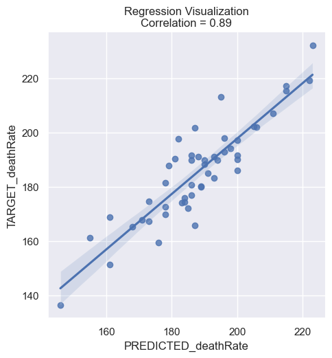

# OLS-Analysis

This project consists in performing an OLS Analysis in a dataset from https://data.world/nrippner/ols-regression-challenge. The proposed challenge is to perform a regression anaçysis to predict the independent feature DeathRate. Here I opted to do the implementation of the linear regression by myself based on the theory.

The deliverables are:

1 - Final model equation

2 - Adjusted R Squared and RMSE of the model

3 - Other questions that will be answered here.

# Discussion

## Model

The chosen model was a basic linear regression from scratch.

The model was implemented as a class with a fit, predict and summary method, the code can be viewed in OLS.py.

## Data cleaning

Some of the data were cleared using IQR, eliminating points where some of the values were not between the firt and the third quartiles.

# Results

The results can be seen in the end of the file OLS_analysis.ipynb, as well as all the data manipulation and analysis.

